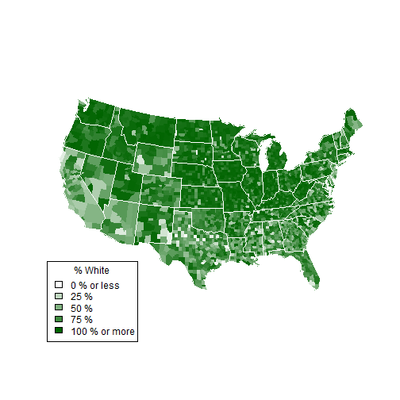

## 1 - Data

<b>Have you ever been interested in How the United States look like?</b>


a) The data came from U.S. Census Bureau for 2010.  

b) As good as it gets.  

c) Has a reputation for accuracy.  

---

## 2 - Summary

a) It will show Counties with the highest percentage by Race.  
b) A Five-number summary showing the overall trend.  


```
##    Min. 1st Qu.  Median    Mean 3rd Qu.    Max. 
##     2.8    67.8    86.2    78.9    94.4    99.2
```

```
##                       Name Total Population White Black Hispanic Asian
## 1626       NEBRASKA,BLAINE              478  99.2   0.8      0.0   0.0
## 1673    NEBRASKA,KEYA PAHA              824  98.9   0.4      0.5   0.1
## 1657     NEBRASKA,GARFIELD             2049  98.7   0.4      0.7   0.1
## 2955 WEST VIRGINIA,LINCOLN            21720  98.7   0.7      0.4   0.1
## 1024       KENTUCKY,LESLIE            11310  98.6   0.8      0.4   0.1
```

---

## 3 - Map

a) Interactive Heat map of the United States.  
b) You will be able to control the percentage and race.

 

---

## 4 - Application

a) Creates a Summary, and a Demographic Map using the 2010 US Census.  

b) You can choose which Demographic to show, and what percent you're looking for.  

c) <b>Summary</b>: This will show the Top 10 Counties for the selected Demographic, and a Five-number summary.

d) <b>Map</b>: Based on the grouping, it will show a Heatmap of the Percentage in each Counties.


